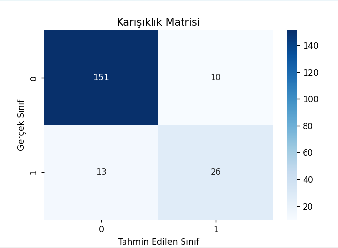
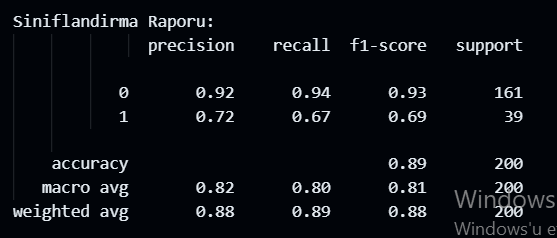

İkili sınıflandırma için PCOS ve PCOS'u etkileyebilecek durumların bulunduğu bir veri seti seçtim. Yazdığım algoritma ile PCOS'un bu durumlara göre hastada olup olmadığını ölçebilecek bir model oluşturmaya çalıştım.

Veri setimde 6 sütun ve 1000 adet satır bulunmaktadır.

Modelleri oluşturduktan sonra scikit-learn kullandığım modelde %88.5 accuracy elde ettim. Scikit-learn kullanmadığım modelde ise en başta %81 accuracy oranı geldi. 
Daha sonrasında bunun sebebini araştırdığımda aşağıdakilere ulaştım

1. scklearn'ün LogisticRegression() sınıfı genellikle özellikleri otomatik olarak ölçeklendirme eğilimindedir.
Benim kodumda ise özellikler ölçeklendirilmeden kullanılmış.

2. scklearnde LogisticRegression() sınıfı varsayılan olarak L2 regularizasyonu kullanır. Bu ağırlıkların aşırı büyümesini engeller ve overfitting'i azaltır.
Benim kodumda hiç regularizasyon yok. Bu nedenle model, daha karmaşık karar sınırları oluşturmaya eğilimli olabilirmiş.

3. learning rate ve iterasyonun yeterli olmaması

Scikit-learn kullanmadığım modelime StandartScaler() fonksiyonu ekleyerek özellikleri ölçeklendirdim. StrandartScaler() her özelliği ortalama 0 ve standart sapma 1 olacak şekilde ölçeklendirir. Eklememin sonucunda accuracy arttı.

L2 regularizasyonunu koduma entegre etmeye çalıştığımda kodumun doğruluğu düştüğü için kaldırdım.

Learning rate ve iterasyon sayısını değiştirdim. Learning rate'i küçülttüğümde accuracyde bir değişiklik çıkmadığı için onu eski haline çevirdim. İterasyon sayısını arttırınca accuracy arttı.

Bu eklemelerin sonucunda iki modelin accuracy eşitlendi. Karmaşıklık matrislerinde de aynı sonucu elde ettim.

İki modeli süre bakımından karşılaştırdığımdaysa modeli scikit-learn'den oluşturduğum da geçen süre  0.0177 iken scikit-learn kullanmadığım modelde geçen süre 0.1600.
10 katı kadar bir fark var. Scikit-learn kullandığım model kullanmadığım modele göre daha optimal. Bunun sebebi scikit-learn'ün L-BFGS, LIBLINEAR, SAG, SAGA gibi daha verimli optimizasyon algoritmaları içeriyor olması olabilir.

Değerlendirme metrikleri seçiminde problem ve sınıf dağılımı önemli midir?
Evet, önemlidir. Dengesiz veri setlerinde accuracy yanıltıcı olabilir dengesiz veri olma olasılığına karşın precision, recall, f1 skoru önemli metrikler haline gelir.  Bu metrikler sınıflar arasındaki dengesizliği göz önünde bulundurur.

Kullandığım veri seti sağlık verileri üzerine olduğu için false negative hatası ciddi sonuçlar doğurabilir. Bu durumda recall metriği önem kazanır. Aşağıda bu metriklerin sonucu verilmiştir.
