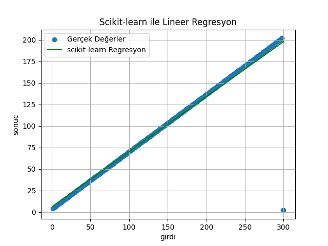

Kaggle'dan lineer regresyon modellerinde kullanılmak üzere oluşturulmuş, X ve Y değerlerini içeren 300 satırlık bir veri seti kullandım.
Matplotlib kullanarak elde ettiğim sonuçları görselleştirdim.
Scikit-learn kullanmadığım En Küçük Kareler yöntemi ile oluşturduğum modelimde şu şekilde bir sonuç aldım.

Scikit-learn kullandığım modelimde şu şekilde bir sonuç aldım.

Bu iki sonuç da birbirinin aynısı şeklinde görünüyor.

Daha sona MSE (Mean Squared Error) kullanarak cost hesaplaması yaptım.
İki modelde de cost değeri 131.1149 şeklinde çıktı.
Sonuçların aynı çıkmasının sebebini araştırdım ve şu sonuçlara ulaştım:
Scikit-learn kütüphanesinin LinearRegression() fonksiyonu da en küçük kareler yöntemini kullanıyormuş.
Arka planda numpy.linalg.lstsq() fonksiyonu gibi çalıştığı için iki ayrı kodda da cost değerleri aynı çıkmıştır.
