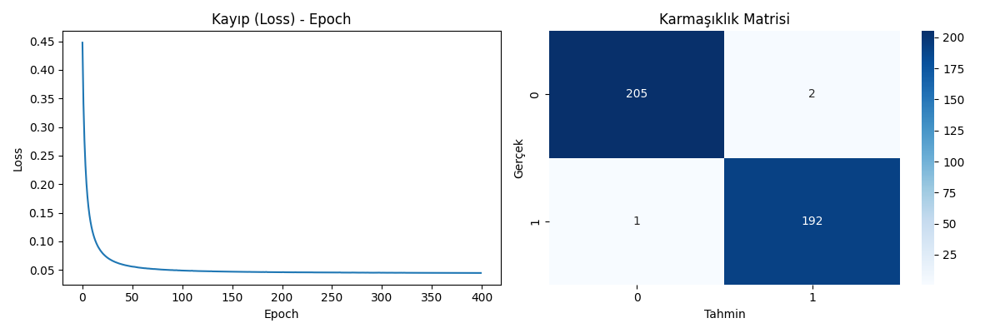

Numpy ile ürettiğim 2000 noktadan oluşan two-moon veri setini kullandım. 
%80 eğitim %20 test şeklinde ayırdım.

Model, üç katmandan oluşan küçük bir beslemeli ağdır. Giriş katmanında x_1 ve x_2 özelliklerini taşıyan 2 nöron bulunur. Bunun hemen ardından gelen gizli katmanda 8 nöron vardır ve bu katman ReLU aktivasyonunu kullanarak doğrusal olmayanlık katar. Son olarak, ağ 2 nöronlu bir çıkış katmanıyla biter; burada softmax aktivasyonu, her örneğin iki sınıftan hangisine ait olduğuna dair olasılık dağılımı üretir.
Xavier yöntemiyle başlatılan ağırlıklar, ileri–geri yayılım sırasında mini-batch gradyan inişiyle güncellenir.

Önce ağda ileri yayılım yaptım: X girdilerini ağırlık-bias kombinasyonuyla gizli katmana taşıyıp ReLU’dan geçirdim, ardından aynı işlemi çıkış katmanına uygulayıp softmax ile sınıf olasılıklarını elde ettim. Kayıp fonksiyonu olarak çok-sınıflı çapraz entropi kullandım. Geri yayılımda softmax-çapraz entropi türevini (y_p - y) hesaplayarak hata sinyalini önce çıkış katmanından, sonra zincir kuralıyla gizli katmana aktardım böylece her katmandaki ağırlık ve bias gradyanlarını buldum. 

Bu gradyanlarla ağırlıkları mini-batch gradyan inişiyle (öğrenme hızı 0.05, batch 64) güncelledim ve süreci 400 epoch tekrarladım. Eğitim boyunca her epoch sonunda kaybı kaydettim; son olarak Matplotlib ve Seaborn ile kayıp-epoch eğrisini ve karmaşıklık matrisini görselleştirdim.

Sonuç olarak model, test verisinde yaklaşık %97 doğruluk elde etti ve çapraz-entropi kaybı 0.09 seviyelerine kadar düştü. Kayıp eğrisi düzenli bir şekilde azaldı, aşırı uyum gözlenmedi. Karmaşıklık matrisine göre hataları yalnızca sınıf sınırına yakın birkaç örnekte gördüm. Bu sonuçlarla, kurduğum MLP modelinin veri kümesini başarılı şekilde öğrendiğini ve genelleme yeteneğinin yüksek olduğunu gördüm.

Karmaşıklık Matrisi ve Loss-Epoch Eğrisi
